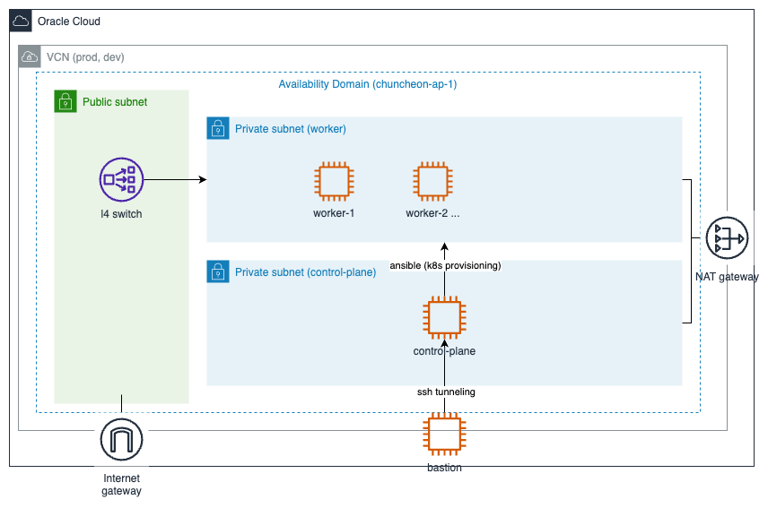

# oci-k8s-terraform-ansible
Efficiently Deploy a Kubernetes Cluster on Oracle Cloud Infrastructure (OCI) using Terraform and Ansible: Practical Examples

# Not Complete yet
1. iaas component <- completed
2. acl setting <- not completed
3. application configuration (ansible) <-- not completed

## Requirements

1. save file '~/.oci/config' link:https://docs.oracle.com/en-us/iaas/Content/API/Concepts/sdkconfig.htm
```
user=${USER_ID}
fingerprint=${FINGERPRINT}
tenancy=${TENANCY_ID}
region=${REGION_ID}
key_file=${PRIVATE_KEY_FILE_PATH}
```

## Execute
1. init
```shell
cd prod
terraform init
```
2. write ./{prod,dev}/terraform.tfvars
```text
compartment_id = "ocid1.tenancy.oc1..aaaafeqfoqemfiop13..."

ssh_public_key_path = "~/Documents/secrets/ssh/minshigee.key.pub"
ssh_private_key_path= "~/Documents/secrets/ssh/minshigee.key"

control_plane_count = 1
worker_count = 1
```
3. plan
```shell
terraform plan
```
3. apply
```shell
terraform apply --auto-approve
```

## Diagram (free-tier)


```scss

┌─────────────────────┐  ┌───────────────────┐
│ Control Plane Node  │  │  Worker Node      │
│   (VM)              │  │    (VM)           │
│   Arm, 2 cores      │  │    Arm, 2 cores   │ 
│   4GB RAM           │  │    8GB RAM        │
│   100GB Volume      │  │    100GB Volume   │
└─────────────────────┘  └───────────────────┘
```
